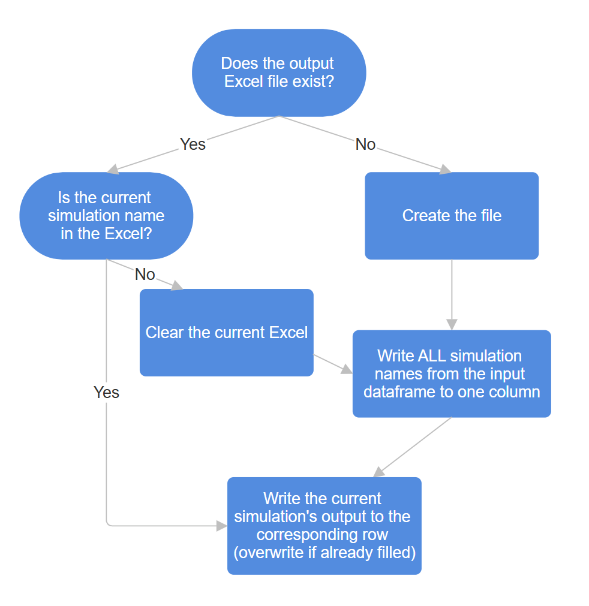

# User guide
Hi

## Table of contents
1. [Input](#1-input)  
- 1.1 [Manual input](#11-manual-input)  
- 1.2 [Excel input](#12-excel-input)  
    - 1.2.1 [Filling the Excel](#121-filling-the-excel)  
    - 1.2.2 [Variables to change](#122-variables-to-change)

2. [Output](#2-output)
- 2.1 [Variables to change](#21-variables-to-change)  
    - 2.1.1 [Categories](#211-categories)
        - [Always on](#always-on)
        - [trajectory](#trajectory)
        - [stability](#stability)
        - [loads](#loads)
        - [rail exit](#rail-exit)
        - [masses](#masses)
        - [thrust curve](#thrust-curve)
        - [launch dynamics](#launch-dynamics)
        - [tank geometry](#tank-geometry)
        - [fuel](#fuel)
        - [oxidizer](#oxidizer)
        - [pressurant](#pressurant)
        - [mass depletion](#mass-depletion)

3. [Future directions]

## 1. Input
The input is split into 3 code blocks - Constants, Manual input, and Excel input.  
* The Constants block must be filled *regardless* of whether you read the input from Excel. However, it shouldn't change frequently.
* The Manual input block should be filled if you want to enter the input manually; if you want to read it from Excel, you can ignore this block.
* The Excel input block should be filled if you want to read the input from Excel.

Note: there is a `read_from_excel` boolean variable in the Excel input block. If you want to read from Excel, set it to `True`. If you want to enter the input manually, set it to `False`.

### 1.1 Manual input
Go to the Excel input block and set the `read_from_excel` boolean to `False`.  
Then go to the Manual input block and enter the input.

### 1.2 Excel input
Go to the Excel input block and set the `read_from_excel` boolean to `True`.  
Then go to the Excel input block and change the variables.

#### 1.2.1 Filling the Excel
The Excel should be filled according to "input_template.xlsx".  
Here are the things that shouldn't change:
* The name of the Excel sheets "Config", "Timings", "Pressurant", "Fuel", and "Oxidizer".
* In each excel sheet, the 2nd row labeled "variables" - these correspond to the names of the variables in the code.
* The position of the tables.
* The existence of the "Defaults" row - anything written in that row will not be simulated.

Here are the things that are allowed to change:
* The number of simulation rows - however, make sure that the number of rows remains constant across the sheets.
* If you really want to, you can permute the columns - just don't move columns 1 and 2.

#### 1.2.2 Variables to change
In the code, you must change the following variables:
* `read_from_excel`: change it to `True`.
* `file_path`: path of the Excel file containing the input. If it is in the same folder as the code, then only the name is needed. Example: `"input_template.xlsx"`.
* `nsims`: the total number of simulation rows in the Excel.
* `sim_index`: the index of the simulation you currently wish to simulate. The "Defaults" row is index 0, the row after that is index 1, and so on. Since the "Defaults" row is row 3 in the Excel, this is also given by [Excel row] - 3.

## 2. Output
The output is written to a csv file.  
You can decide whether to create a new csv file, overwrite the current one, or write to the end of the current one.  
You can also decide on the categories of outputs to write.  
To do so, you must change the Output code block.

### 2.1 Variables to change
In the code, you must change the following variables:
* `out_filename`: name of the output file. A new file will be created if a file with the given name does not exist.
* `overwrite`: in case a file with the given name already exists, setting this to `True` will overwrite the file, and setting this to `False` will append to the end of the file. In case a file with the given name does not exist, this is automatically set to `True`.  
Note: a header will be generated for the csv file *only if* this is set to `True`. Hence, while this is set to `False`, do not change the output categories, else the header will not longer correspond to the output.
* `categories`: a list of categories of outputs you want to write to the csv.

#### 2.1.1 Categories
##### Always on
In case the `categories` list is left empty, the 4 following values will be written by default:
* Simulation name
* Rail exit static margin
* Rail exit velocity
* Apogee

##### "trajectory"
Values related to the trajectory:
* Apogee ASL
* Maximum velocity
* Maximum acceleration
* Maximum mach number
* Time to apogee
* Total flight time

##### "stability"
Values related to the stability:
* Static margin at liftoff
* Minimum static margin

##### "loads"
Values related to the loads:
* Maximum dynamic pressure
* Maximum thrust load

##### "rail exit"
Values at rail exit:
* Rail exit time
* Rail exit velocity
* Rail exit stability margin
* Rail exit angle of attack
* Rail exit thrust-weight ratio
* Rail exit Reynolds number

##### "masses"
Different masses:
* Dry mass
* Wet mass
* Wet mass at the start of the simulation

##### "thrust curve"
Values related to the thrust curve:
* Total impulse
* Ramp-up slope
* Derating slope
* Shutdown slope

##### "launch dynamics"
Values related to the launch dynamics:
* Hold-down break time
* Rail exit time
* Rail exit velocity
* Wet mass
* Wet mass at the start of the simulation

##### "tank geometry"
Values related to the tank geometry:
* Equivalent cylindrical height
* Tank total volume

##### "fuel"
Values related to the fuel:
* Volume of free fuel
* Bottom position of free fuel
* Height of free fuel
* Mass of free fuel
* Volume of fixed fuel
* Center of mass of fixed fuel from bottom
* Mass of fixed fuel
* Volume of total fuel
* Center of mass of total fuel from bottom
* Height of total fuel
* Initial ullage volume of fuel
* Initial ullage percentage of fuel
* Flight ullage volume of fuel
* Flight ullage percentage of fuel

##### "oxidizer"
Values related to the oxidizer:
* Volume of free oxidizer
* Bottom position of free oxidizer
* Height of free oxidizer
* Mass of free oxidizer
* Volume of fixed oxidizer
* Center of mass of fixed oxidizer from bottom
* Mass of fixed oxidizer
* Volume of total oxidizer
* Center of mass of total oxidizer from bottom
* Height of total oxidizer
* Initial ullage volume of oxidizer
* Initial ullage percentage of oxidizer
* Flight ullage volume of oxidizer
* Flight ullage percentage of oxidizer

##### "pressurant"
Values related to the pressurant:
* Mass of fixed volume

##### "mass depletion"
Values related to the mass depletion:
* Mass of free fuel
* Mass of free oxidizer
* Hold-down break time
* Hold-down break index (index of time array that corresponds to the hold-down break time)
* Fuel lost before break
* Oxidizer lost before break

## 3. Future directions
### 3.1 Improving the output
Currently, the output process is still rather complicated, requiring the change of many variables which could be avoided through automation.  
The idea would be to get rid of the `overwrite` boolean, and output to an Excel instead of a csv.  
I propose the following plan:

### 3.2 Running all simulations at once
Currently, the simulations are run one by one through a Jupyter notebook.  
The advantages are that the code is directly accessible, and it is also more useful for in-depth analysis of a single simulation.  
However, it becomes tedious when multiple simulations must be run, and only basic information is required (eg. apogee, rail exit speed/static margin, etc.).  
To run multiple simulations at once, I propose the following plan:
* Switch to a normal python program instead of a Jupyter notebook.  
* Convert each section of the notebook into a function that takes 2 arguments: the input, and the output (to which it should add its results)
* Don't show the graphs; if possible, save the graphs as images in a designated folder (maybe create a new folder for each batch of simulations). If not, just ignore them.
